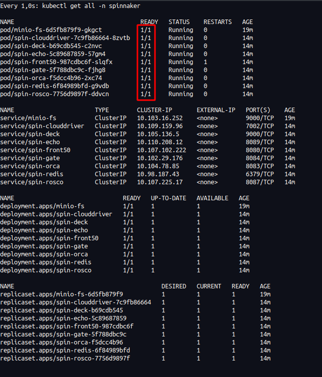
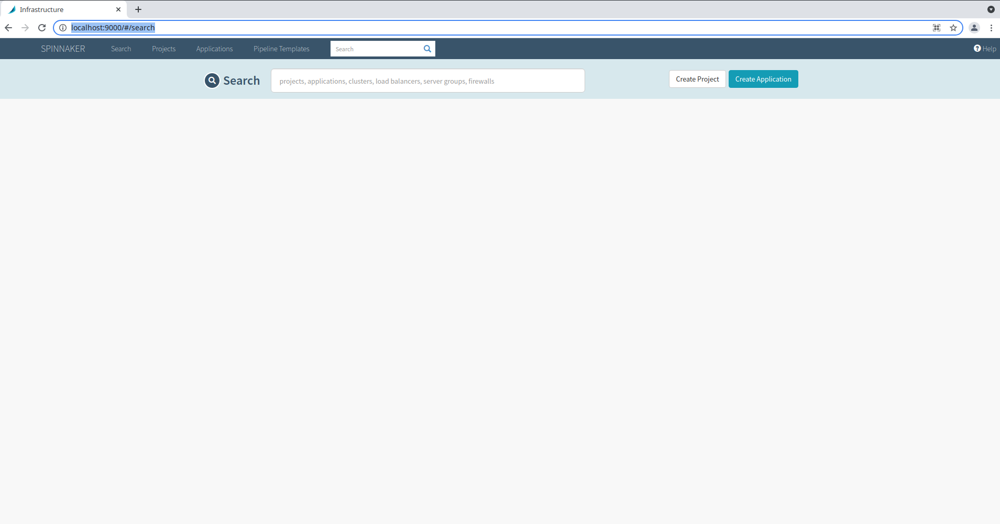

# Instrucciones de instalación

## 1. Iniciamos Minikube

```bash
minikube start --kubernetes-version v1.20.0
```

Y creamos un namespace para spinnaker:

```
kubectl create namespace spinnaker
```

## 2. Desplegando Minio

Spinnaker necesita un sistema de storage para hacer persistencia. Esto podría ser un bucket S3 de AWS, pero para simplificar el ejemplo
y no depender de AWS, vamos a desplegar **Minio**, que es un servicio que proporciona persistencia y es compatible con el protocolo de S3.

Simplemente necesitamos ejecutar:

```
kubectl apply -f minio.yaml -n spinnaker
```

## 3. Instalar Halyard

Halyard es una herramienta para configurar instalar y actualizar Spinnaker. Es válido para diferentes entornos, sólo necesita tener un `kubectl` instalado y configurado a un cluter kubernetes.

Podríamos instalar la herramienta nativamente en Linux, pero vamos a utilizar una imagen docker ya disponible de Halyard que cuenta con todas las herramientas necesarias para utilizar `kubectl`.

El siguiente comando arrancará Halyard usando docker y compartiendo todos los volumenes necesarios para trabajar con kubectl:

```bash
docker run --name halyard --rm -d --network host \
    -v "${HOME}"/.kube/:/home/spinnaker/.kube -v ~/.kube/:/root/.kube -v "${HOME}"/.minikube/:/root/.minikube \
    -v "${HOME}"/.minikube/:"${HOME}"/.minikube -it ghcr.io/ahmetozer/halyard-container &&
    docker logs -f halyard
```

> Nota: Si se quiere mantener persistencia de halyard hay que compartir el volumen `-v "${HOME}"/.hal:/home/spinnaker/.hal` pero para la demo no es necesario.

Cuando el contenedor muestre `Halyard started` estaremos listos para comenzar la instalación.
Ejecutamos una sesión de bash dentro:

```bash
docker exec -it halyard bash
```

Una vez dentro:

```bash
# Configuramos el contexto (minikube)
CONTEXT=$(kubectl config current-context)

# Creamos un service account para Spinnaker
kubectl apply --context $CONTEXT \
    -f https://spinnaker.io/downloads/kubernetes/service-account.yml

# Guardamos el secreto/token para configurarlo en kubectl
TOKEN=$(kubectl get secret --context $CONTEXT \
   $(kubectl get serviceaccount spinnaker-service-account \
       --context $CONTEXT \
       -n spinnaker \
       -o jsonpath='{.secrets[0].name}') \
   -n spinnaker \
   -o jsonpath='{.data.token}' | base64 --decode)

# Configuramos kubectl
kubectl config set-credentials ${CONTEXT}-token-user --token $TOKEN
kubectl config set-context $CONTEXT --user ${CONTEXT}-token-user
```

Configuramos Halyard para trabajar con el cluster

```bash
# Creamos cuenta y configuramos como provider "kubernetes
hal config provider kubernetes enable

ACCOUNT="my-k8s-account"

hal config provider kubernetes account add ${ACCOUNT} \
    --context ${CONTEXT}

# Configuramos el modo de despliegue distribuido (necesario para kubernetes)
hal config deploy edit --type distributed --account-name $ACCOUNT
```

### 3. Configuramos en Halyard el servicio de Minio

Le decimos a Halyard la persistencia que vamos a usar, para que cuando vaya a desplegar el servicio,
utilice el Minio recién desplegado.

Y ejecutamos los siguientes comandos
```bash
DEPLOYMENT="default"
mkdir -p ~/.hal/$DEPLOYMENT/profiles/
echo spinnaker.s3.versioning: false > ~/.hal/$DEPLOYMENT/profiles/front50-local.yml

# Configuramos aquí las variables de MINIO anteriores
echo minio123 | hal config storage s3 edit --endpoint http://minio-fs:9000 \
    --access-key-id minio \
    --secret-access-key

# Habilitamos S3
hal config storage edit --type s3
hal config storage s3 edit --path-style-access=true
```

### 4. Desplegamos Spinnaker en minikube

Seleccionamos una versión:

```
hal config version edit --version  1.26.3
```

Desplegamos:

```
hal deploy apply
```

Cuando todo este "READY" el servicio se podrá utilizar

```bash
watch -n1 kubectl get all -n spinnaker
```



Para poder conectarnos, desde el contenedor de Halyard debemos ejecutar:

```bash
hal deploy connect
```

```bash
Forwarding from 127.0.0.1:8084 -> 8084
Forwarding from [::1]:8084 -> 8084
Forwarding from 127.0.0.1:9000 -> 9000
Forwarding from [::1]:9000 -> 9000
```

Esto hará de proxy para que podamos conectarnos por localhost:9000 desde el browser:




